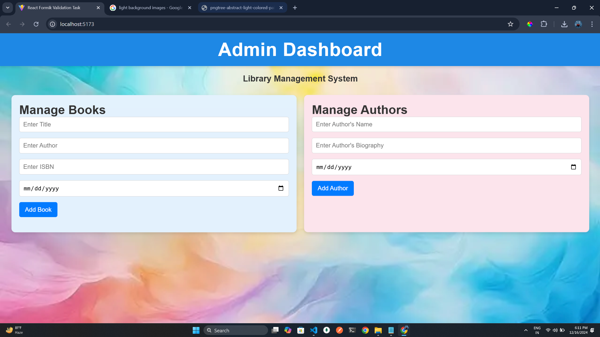
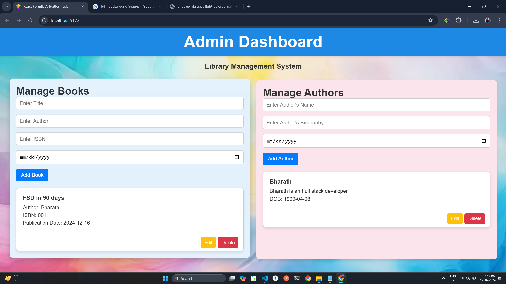

# Admin Dashboard - Library Management System

This React application serves as an **Admin Dashboard** for a Library Management System. It provides CRUD (Create, Read, Update, Delete) functionalities for managing books and authors within a library.

This app allows users to add, edit, and delete book and author entries, with built-in form validations to ensure proper input. If any field is left empty or filled incorrectly, the app will display appropriate validation messages.

## Introduction

The Admin Dashboard offers functionalities to manage books and authors in the library system. Administrators can perform operations like adding new books and authors, editing existing details, and removing entries when needed.

## Features

- **Book Management:** Allows administrators to perform CRUD operations on books.
- **Author Management:** Provides tools for managing author details.
- **Form Validation:** Ensures all required fields are filled and valid before submission.
- **Responsive UI:** Works seamlessly on all screen sizes for a smooth user experience.

## Components

### **BookManagement Component**
- **Description:** Handles book-related operations within the system.
- **Features:** Add, edit, delete, and view book information.

### **AuthorManagement Component**
- **Description:** Manages author-related functionalities.
- **Features:** Add, edit, delete, and view author details.

## Application Preview

Here’s a preview of the Admin Dashboard for the Library Management System:

  

